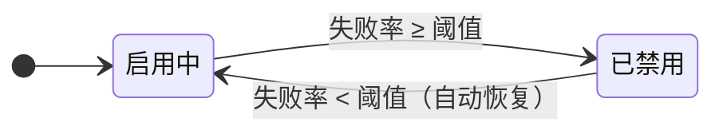
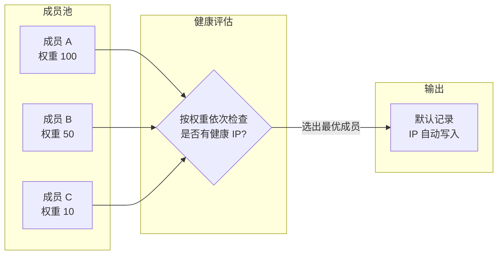
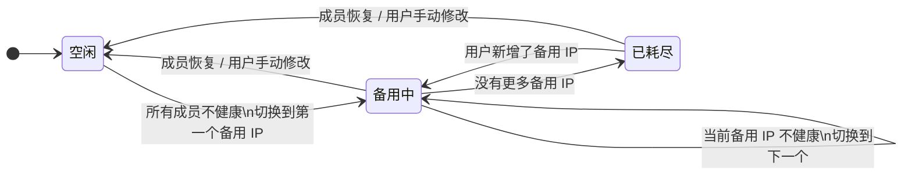

# GTM DNS 帮助文档

## 登录华为云，点击右上角头像按下图所示添加外部访问密钥

**第一步：点击头像 → 我的凭证**

**第二步：访问密钥 → 新增访问密钥 → 勾选确认 → 下一步**

**第三步：填写描述 → 确定**

**第四步：立即下载密钥文件**

**第五步：打开下载的 credentials 文件，获取 AK 和 SK 填入面板**

---

## 快速开始

1. 在「账户」页面添加您的华为云账户（需要 Access Key 和 Secret Key）
2. 进入账户后，点击「从华为云同步」拉取 DNS Zone 列表
3. 进入 Zone 详情，同步解析记录
4. 为需要监控的记录启用健康检测（ICMP / TCP）
5. 在「可用性组」页面将多条记录组成一个组，并手动指定默认记录（**手动指定，一般选择“默认线路(default view)“**，当所有线路解析失效的时候，还**默认线路兜底**）

---

## 健康检测

系统按设定间隔对所有启用了 ICMP 或 TCP 探测的记录执行自动检测。
当窗口内**失败率超过阈值**时自动禁用，恢复后自动重新启用。

**失败判定**：ICMP 和 TCP 两种探测中，所有**已启用**的探测全部失败，才算该 IP 失败。

在「设置」页可调整：检测间隔、时间窗口、失败率阈值。

---

## 可用性组

将多条解析记录组成一个池，系统自动选出最健康的成员，把它的 IP 写入「**默认记录（手动指定）**」，
实现 DNS 层面的自动故障切换。

**评估规则**

- 按权重从高到低依次检查每个成员
- 找到第一个**有健康 IP 且状态为启用**的成员，将其 IP 写入默认记录
- 若所有成员均不健康，启动备用 IP 池流程（见下节）

> **默认记录不会被自动禁用**。它的 IP 内容完全由可用性组管理，独立于健康检测的禁用逻辑。

---

## 备用 IP 池

每个可用性组可以配置一组备用 IP。当所有成员都不健康时，系统会按优先级逐个尝试备用 IP，作为最后一道防线。

**如何使用：**

1. 进入可用性组详情页
2. 在「备用 IP 池」区域点击「+ 添加备用 IP」
3. 输入 IP 地址，新增的 IP 自动排在末尾
4. 可添加多个备用 IP，系统会按添加顺序依次尝试

**工作流程：**

**注意事项：**

- **默认记录必须启用健康检测**（ICMP 或 TCP），否则系统无法判断备用 IP 是否健康，备用流程不会启动
- 每个检测周期尝试一个备用 IP，通过健康检测确认其是否可用
- 一旦有成员恢复健康，系统会**自动切回该成员**，备用流程结束（成员始终优先）
- 如果所有备用 IP 都不健康，系统停止切换，保持当前默认 IP 不变
- 在「已耗尽」状态下新增备用 IP，系统会自动继续尝试
- 如果您手动修改了默认记录的 IP 且该 IP 健康，备用流程会自动停止

---

## 变更日志

| 事件 | 含义 |
|---|---|
| `MEMBER_DISABLED` | 成员因失败率过高被自动禁用 |
| `MEMBER_ENABLED` | 成员健康恢复，被自动重新启用 |
| `DEFAULT_UPDATED` | 默认记录的 IP 已切换到新的最优成员 |
| `FALLBACK_ACTIVATED` | 所有成员不健康，开始使用备用 IP |
| `FALLBACK_SWITCHED` | 当前备用 IP 不健康，切换到下一个备用 IP |
| `FALLBACK_EXHAUSTED` | 所有备用 IP 已尝试完毕，均不健康 |
| `FALLBACK_RECOVERED` | 成员恢复健康或用户手动干预，退出备用模式 |

---

## A / CNAME 混合权重（PowerDNS）

在 PowerDNS 账户里，给 CNAME 记录填上权重，它就会加入同名同线路的加权 A/AAAA 组：

- 按客户端子网哈希选组：同一客户端始终得到同一种结果；命中 CNAME 组的客户端，查任何类型都会被重定向到该目标。
- 一旦某个名字有了带权重的 CNAME，这个名字下的 CNAME 记录和启用中的 A/AAAA 记录都必须带权重（未带权重的启用记录请先编辑加上权重，或删除；暂停中的 A/AAAA 可以先不填，启用前补上——这也是把「暂停的 A + 普通 CNAME」迁移成混合权重的做法：先给 CNAME 填权重，再给 A 填）。
- 不填权重的 CNAME 仍是普通 CNAME：启用时要求同名其它记录都处于暂停状态。
- 暂停/删除带权重的 CNAME 会把流量全部交还给地址组；给 CNAME 去掉权重相当于把它变成普通 CNAME，同样受独占规则限制。
- 同名同时有 A、AAAA 和带权重的 CNAME 时，先按客户端决定「走 CNAME 还是走地址」：CNAME 的权重和该线路上全部地址记录（A 加 AAAA）的权重一起分；走地址的客户端查 A 在 A 记录里按权重选，查 AAAA 在 AAAA 记录里选，双栈客户端两种地址都拿到。加上 AAAA 会摊薄 CNAME 的份额，想保持比例就把 CNAME 权重相应调高。

节点侧需要部署支持 `isp_route_mixed` / `weighted_mixed` 的 `isp_routes.lua`。

## 常见问题

**Q: 如何修改检测间隔？**
A: 进入「设置」页面修改「检测间隔」，保存后立即生效。

**Q: 记录被自动禁用了怎么办？**
A: 检查对应 IP 的网络连通性，恢复后系统会自动重新启用。

**Q: 为什么默认记录的 IP 没有切换？**
A: 常见原因：
- 所有成员都没有健康 IP（网络故障或探测未启用）
- 最优成员的 IP 与默认记录当前 IP 相同，无需切换
- 成员未启用任何探测（无数据的成员不会被选中）

**Q: 备用 IP 池显示「已耗尽」怎么办？**
A: 说明所有备用 IP 都已尝试且均不健康。您可以：
- 添加新的备用 IP，系统会自动继续尝试
- 检查备用 IP 的网络连通性
- 排查成员不健康的根本原因，成员恢复后系统会自动切回

**Q: 为什么备用 IP 池没有生效？**
A: 请确认默认记录已启用健康检测（ICMP 或 TCP）。如果默认记录没有开启探测，系统无法判断备用 IP 的健康状态，备用流程不会启动。
